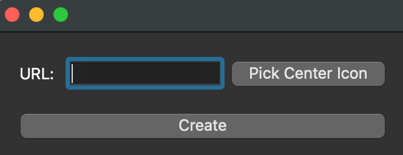

# Simple App to Generate QR Code From a Given URL

------


## Test Run

the project is managed using Poetry.

You can use the following steps to run the program from the source:

* Install Python 
    - windows
    ```sh
    winget install Python.Python.3.9
    ```

    - mac
    ```sh
    brew install python@3.9
    ```

    - linux
    ```sh
    sudo apt update && \
    sudo apt install -y python3.9 && \
    sudo apt install python3.9-venv python3.9-distutils && \
    curl -sS https://bootstrap.pypa.io/get-pip.py | sudo pyhon3.9
    ```

* Install Poetry with curl:
```sh
curl -sSL https://install.python-poetry.org | python3 -
```

* Setup the environment, and install all dependeinces and cli entry points:

```sh
poetry install
```

and then run the sheduler script
```sh
poetry run qrCodeGenGUI
```